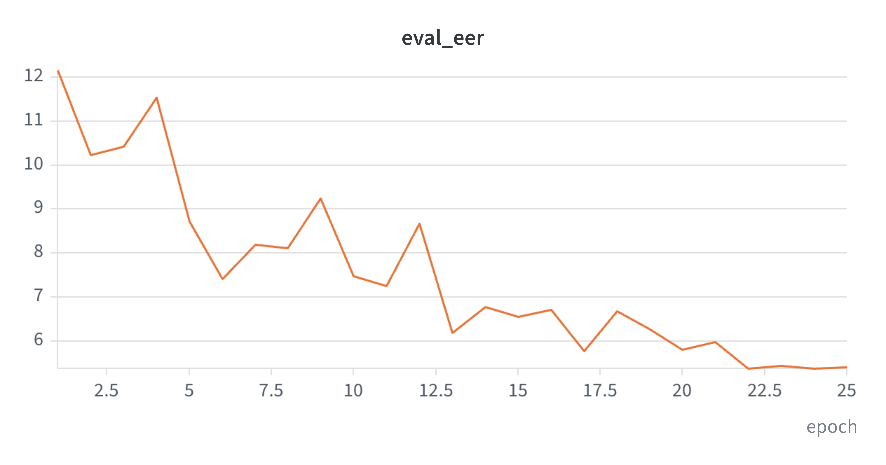
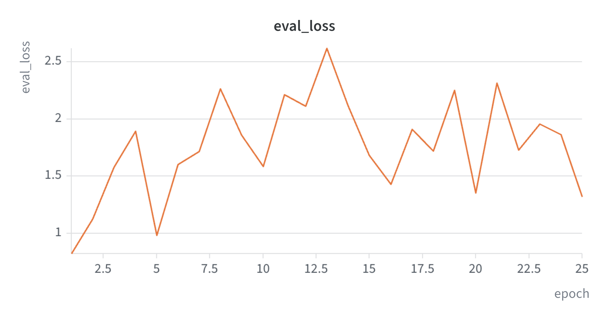
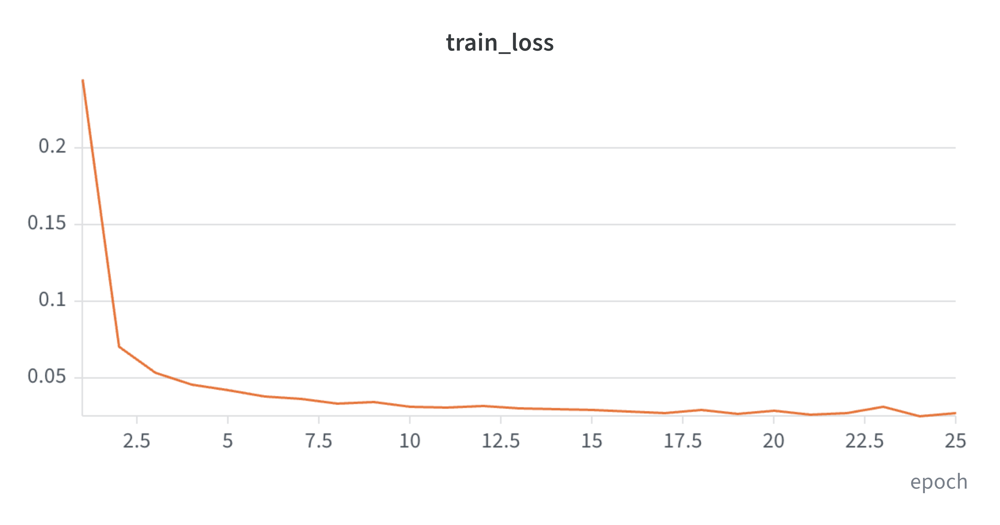

# Voice Anti-Spoofing with LCNN & A-Softmax

Реализация легковесной сверточной нейросети (**LCNN**) с **Max-Feature-Map (MFM)** и угловой функцией потерь **A-Softmax (SphereFace)** для бинарной детекции синтезированной речи на датасете **ASVspoof 2019 Logical Access (LA)**.

---

| Модель | Функция потерь | Признаки (Features) | Best Eval EER (%) |
| :--- | :--- | :--- | :---: |
| **Baseline (LFCC-GMM)** | — | LFCC | ~9.57% |
| **LCNN (Наш проект)** | **A-Softmax ($m=4$)** | **STFT Log-Power Spectrogram** | **5.3822%** |

> Weight & bias: [logs](https://api.wandb.ai/links/andrei2008kz-hse-university/6qra82eb)

---

1. **Извлечение спектрограмм:**
   - Быстрое преобразование Фурье (STFT) с окном Блэкмана (Blackman window, `n_fft=1724`, `win_length=1724`, `hop_length=129`).
   - Логарифмирование мощности $\log(|X|^2 + 10^{-9})$ и выравнивание длины до фиксированных 600 фреймов с паддингом.
2. **Backbone (LCNN):**
   - Использование **Max-Feature-Map (MFM)** вместо стандартных ReLU/GELU: разделение каналов пополам и выбор максимума $\max(A, B)$.
   - 5 сверточных MFM-блоков с Batch Normalization и MaxPool2d.
3. **Metric Learning Classifier (A-Softmax / SphereFace):**
   - Нормализация весов и признаков на единичную сферу.
   - Добавление углового штрафа $m=4$ через кратные углы: $\psi(\theta) = (-1)^k \cos(4\theta) - 2k$.
   - Динамический график затухания $\lambda$ для стабилизации сходимости на ранних этапах.

---

## Кривые обучения

Логи обучения за 25 эпох с оптимизатором **SGD (momentum=0.9, weight_decay=5e-4)** и шедулером **CosineAnnealingLR**:

  <table>
    <tr>
      <td align="center"><b>Eval EER (%)</b></td>
      <td align="center"><b>Loss Eval</b></td>
       <td align="center"><b>Loss Train</b></td>
    </tr>
    <tr>
      <td></td>
      <td></td>
       <td> </td>
    </tr>
  </table>
   
 

---
